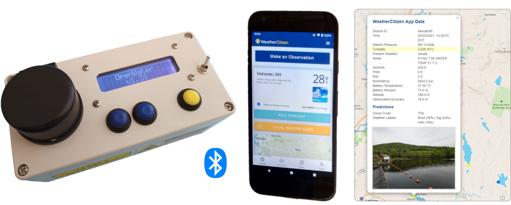

# OpenWater: A Citizen Science Water Quality Monitoring Platform
The goal of this project is to provide the bill of materials, design files, electronics, and firmware to allow you to build your own research grade turbidity meter. We hope that this work will help you to evaluate water quality in your local community through education or citizen science projects.

## Bill of Materials

## Mechanical Design

## Electronics

## Firmware

## Assembly and Operation
For instructions on how to assemble the meter, see the [Documentation](https://github.com/creare-com/OpenWater/blob/master/Documentation)

## License
All of these materials are released under the MIT License.  Use at your own risk.